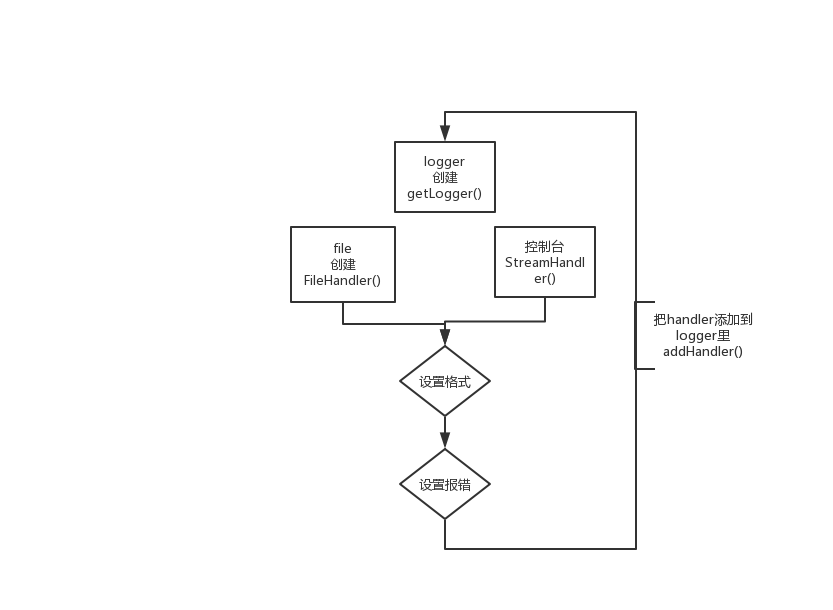

* email发送
---
已经写好，配置信息就好
注：QQ邮箱使用ssl相关，需替换smtp地址
```python
# 设置变量并调用发送邮件
from1 = '发送出去的邮箱@163.com这里改上面smtp地址也要改，要记得' #发送出去的邮箱
to = '接收的邮箱' #接收的邮箱
# 接收的邮件地址
title = '19-54 title python 全栈自动化测试 文件 行不行 图片'
content = 'content正文 金马奖 金鸡奖 杨天宝'
attach = 'D:\\python_code\\re_Automation\\excel_demo.xlsx'#附件-文件
pic = 'D:\\python_code\\re_Automation\\md_pic\\logging.FileHandler.png'#附件-图片
print('-执行-')

try:
    smtpObj = SendMail()
    smtpObj.send_mail(from1, to, title, content, type='plain', attach=attach, pic=pic)
    print("邮件发送成功")
except smtplib.SMTPException as ex:
    print("Error: 无法发送邮件",ex)
```
* DES加密
---
语法格式：  
pyDes.des(key,[mode],[IV],[pad],[padmode])  

key:加密密钥，长度只能为8，必选  
mode:加密方式。ECB(默认)、CBC(安全性好于前者)  
IV:初始字节数(长度只能为8位)，如果你选择的加密方式为CBC就必须有这个参数，否则可以没有  
pad:加密时，将该字符添加到数据的结尾；解密时，将删除从最后一个往前的8位  
    &nbsp；如果被加密的数据不是8 bytes的倍数，则pad的数量只能为单数  
    &nbsp；如果被告密的数据是8 bytes的倍数，则无所谓  
padmode:PAD_NORMAL(可有pad参数)  
        PAD_PKCS5(不能有pad参数)  


* log写入到文件中文编码问题  
---
1,logging.basicConfig基本配置，
当 stream 和 filename 同时指定时, stream 被忽略  
利用 stream 输出到文件便可以解决编码问题, 然而这样一来却也带来了一些问题  
首先, 文件在程序运行过程中必须始终保持打开状态  
其次, 不能同时进行写入文件与控制台输出  
```python
import logging
file = open("log", encoding="utf-8", mode="a")
logging.basicConfig(level=logging.DEBUG,
                    stream=file,
                    format="%(asctime)s "
                           "%(filename)s [line:%(lineno)d] "
                           "%(levelname)s\n"
                           "%(message)s",
                    datefmt="%a, %d %b %Y %H:%M:%S"
                    )

logging.debug("调试信息")
logging.info("普通信息")
logging.warning("警告信息")
logging.error("错误信息")
logging.critical("严重错误信息")
file.close()

```
2,logging.FileHandler中文编码问题  
在logging.FileHandler(path) 中添加指定编码方式 encoding='utf-8' 即可，  
logging.FileHandler(path, encoding='utf-8')   
详见D:\python_code\re_Automation\0325_multithreading_log_md5.py  


* 线程传参
---
```python
#创建线程，注意语法格式。target为目标函数，args为传递的参数（可选）
#可传：('t2-小萌',)、args=(i,)i为数组，遍历执行、args=['t4-小小萌',]、args=(m,)把数组当作1个参数
t1=threading.Thread(target=music)
t2=threading.Thread(target=book,args=('t2-小萌',))#注意这个逗号 输出： t2-小萌
m1=['t3-小萌1','t3-小萌2','t3-小萌3',]
for i in m1:
    t3=threading.Thread(target=book,args=(i,))
    t3.start()
    #输出： t3-小萌2
    #输出： t3-小萌3
    #输出： t3-小萌1
t4=threading.Thread(target=book,args=['t4-小小萌',])#输出： t4-小小萌
m=[1,2,3,4,5]
t5=threading.Thread(target=book,args=(m,))#输出： [1, 2, 3, 4, 5]

#启动线程
t1.start()
t2.start()
t4.start()
t5.start()
print('抢地主')
```

* 私有变量和方法
---

__private_attrs:两个下划线开头，生命该属性为私有，不能在类的外部被使用或直接访问。


在类内部的方法中使用：self.__private_attrs

个人觉得python的私有没有什么意义，规则存在，
但实际通过对象调用类，调用私有方法依然可以使用
```python
class Animal:
    def __heshui(self):
        print('动物，喝水')

    def test_heshui(self):
        self.__heshui()#调用类内部私有方法：self.__heshui()需要使用self

class Cat(Animal):
    def heshui(self):
        super()._Animal__heshui()
    # def cat_heshui(self):
    #     pass
new_cat=Cat()
# new_cat.__heshui()#报错 外部无法访问

new_cat.heshui()#运行正常，打印：动物，喝水

```
* testlink+vertrigo
---
windows下安装testlink，进入安装页面后，在检查一些相关配置环境时报错，如下：  

Checking if /var/testlink/logs/ directory exists [S] </B<< td> Failed!  
Checking if /var/testlink/upload_area/ directory exists [S] </B<< td> Failed!  


解决办法：  
修改testlink下的config.inc.php文件：  
注释：$tlCfg->log_path = '/var/testlink/logs/'; /* unix example   
添加：$tlCfg->log_path = '[testlinkDir]/logs/';  

注释：$g_repositoryPath = '/var/testlink/upload_area/'; /* unix example   
添加：$g_repositoryPath = '[testlinkDir]/upload_area/';  
注意：[testlinkDir] 表示安装目录路径，如：D:\xampp\htdocs\testlink，  

改‘\’为‘/’  
 
修改后保存，刷新页面。  


其他补充  
1.Testlink安装完成，可使用以下地址访问  
http://localhost/testlink-1.9.19/login.php  
访问的账号密码为admin/admin  

2.若需要管理mysql数据库，访问地址为  
http://localhost  
http://localhost/phpmyadmin/index.php  
访问的账号密码为root/vertrigo  

3.Testlink汉化，不同账号可以单独设置。  
登录Testlink，mysettings>Personal data>locale>Chinese Simplified，设置后save保存。  


* 数据库插入数据
---
1.连接数据库  
2.创建游标  
3.执行cursor.execute(stu_info)，stu_info即SQL语句用''' '''最方便  
4.cursor.close()  # 关闭游标  con.close()  # 关闭连接  
```python
# 元组插入
print('----元组插入---')
# 此处%s为占位符，不是格式化字符串，所以age用%s
stu_info_tup = '''
insert into student(StdName,Gender,Age)values(%s,%s,%s)
'''
data = ('小强', 'M', 21)
cursor.execute(stu_info_tup, data)

# 提交操作，不提交不生效，2选1
con.commit()
# cursor.execute('commit')

cursor.close()  # 关闭游标
con.close()  # 关闭连接

```

* python操作excel 模块openpyxl
---
https://www.cnblogs.com/zeke-python-road/p/8986318.html  
```python
# import openpyxl
from openpyxl.styles import Font,colors,alignment
from openpyxl import Workbook,load_workbook
# load_workbook已存在 Workbook不存在可创建,原内容清空
```

赋值  
```python
ws2['b3']='ws2哈哈哈'  #赋值方式1
d = ws2.cell(row=4, column=2, value=10)  #赋值方式2
ws2.cell(row=4, column=2).value='是10，哈哈哈' #赋值方式3
```

切换操作的表  
ws=wb.create_sheet('testsheet01')  
ws1=wb.active  
ws2=wb['testsheet']  
  